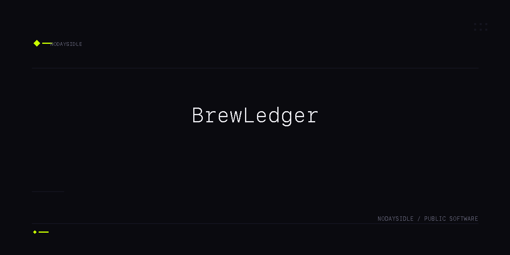

# BrewLedger

> A native macOS app for home coffee enthusiasts to log, track, and review their brews — local-first, no cloud, no accounts.


## Overview

BrewLedger is a focused, private logbook for home coffee brewing. Track beans, log brews with ratings, search your history, and export data — all stored locally on your Mac.

No cloud sync, no accounts, no telemetry.

## Features

- **Log brews** — bean name, grind size, water temperature, brew method, and 1–5 rating
- **Manage beans** — inventory with roast date and remaining amount
- **Search and filter** — find past brews by bean, method, or rating
- **Export data** — save brew history as JSON
- **Local-first** — all data stays on your Mac

## Technology

| Area | Technology |
|------|------------|
| Interface | SwiftUI 6 |
| Application | Swift 6 |
| Data | SwiftData |
| Build | Xcode project (`xcodebuild`) |

## Requirements

- macOS 14 (Sonoma) or later
- Xcode 15.3 or later (or Command Line Tools with `xcodebuild`)

## Installation

Build from source:

```bash
xcodebuild -project BrewLedger.xcodeproj -scheme BrewLedger -destination 'platform=macOS' build
cp -R ~/Library/Developer/Xcode/DerivedData/BrewLedger-*/Build/Products/Debug/BrewLedger.app /Applications/
open /Applications/BrewLedger.app
```

## Development

```bash
xcodebuild test -project BrewLedger.xcodeproj -scheme BrewLedger -destination 'platform=macOS'
```

14 tests covering model validation, persistence round-trip, and JSON export correctness.

## Architecture

BrewLedger follows a simple MV-like architecture:

```
RootView (TabView)
├── DashboardView    — recent brews and bean count summary
├── BrewListView     — searchable brew log
│   ├── BrewDetailView  — full detail and delete
│   └── AddBrewView     — brew logging form
├── BeanInventoryView   — bean list with context menu delete
│   └── AddBeanView     — bean entry form
└── SettingsView     — default method and JSON export

Models: Brew, Bean (SwiftData @Model)
Storage: PersistenceController (ModelContainer)
Services: DataExportService (JSONEncoder + NSSavePanel)
```

## Design Decisions

- **Rating clamped at model level** — `Brew.init` enforces 1–5, not just the view stepper
- **Bean amount non-negative** — clamped at model init
- **macOS-native delete** — context menu and toolbar buttons only, no swipe-to-delete
- **AppKit bridge isolated** — `DataExportService.swift` is the only file importing `AppKit`
- **In-memory test container** — `PersistenceController.inMemory` for isolated test runs
- **JSON export decoupled from dialog** — `exportJSON()` is pure and testable; `savePanel()` is manual verification only

## Project Structure

```
BrewLedger/
├── BrewLedger.xcodeproj/     # Xcode project
├── BrewLedger/
│   ├── BrewLedgerApp.swift   # @main app entry
│   ├── Views/                # 8 SwiftUI views
│   ├── Models/               # Brew, Bean (@Model)
│   ├── Storage/              # PersistenceController
│   ├── Services/             # DataExportService
│   └── Assets.xcassets/      # App icon and asset catalog
├── BrewLedgerTests/          # 14 unit tests across 4 suites
├── PRD.md                    # Product requirements
├── ARD.md                    # Architecture requirements
├── TRD.md                    # Technical requirements
├── TASKS.md                  # Implementation task breakdown
├── AGENTS.md                 # Agent execution contract
└── USERGUIDE.md              # End-user guide
```

## Limitations

- No cloud sync, accounts, or sign-in
- No analytics, telemetry, or tracking
- No push notifications or background services
- No multi-user or collaboration features
- Not a recipe app, coffee timer, or brewing calculator

## Status

Active — feature-complete for v1. Local-first coffee logbook.

## Contributing

This repository is not currently accepting external contributions.

## License

License not yet specified.
